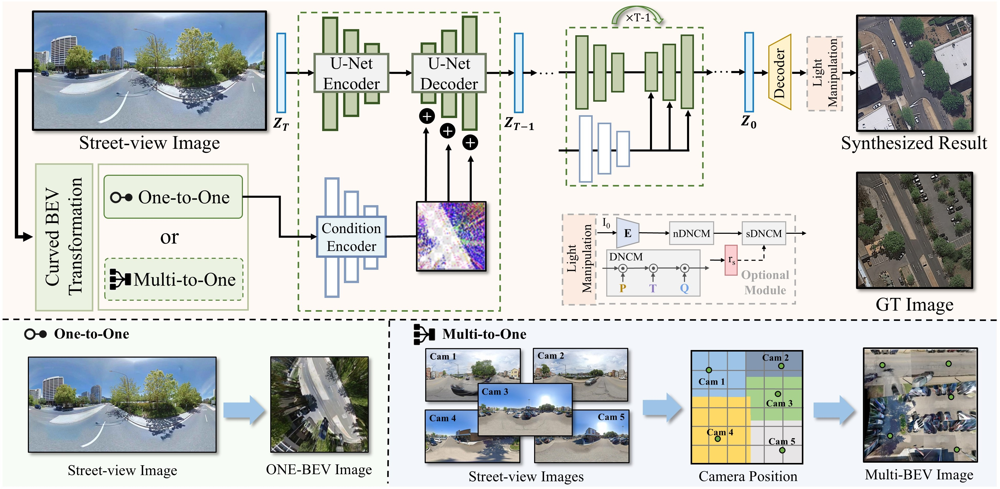

<div align="center">
	
	<h1>Ground-to-Aerial Image Synthesis with Diffusion Models and BEV Paradigm</h1>
	<a href="https://skydiffusion.github.io/"></a>
	<a href=""></a>
	<a href=""></a>
</div>




## Abstract
Ground-to-aerial image synthesis focuses on generating realistic aerial images from corresponding ground street view images while maintaining consistent content layout, simulating a top-down view. The significant viewpoint difference leads to domain gaps between views, and dense urban scenes limit the visible range of street views, making this cross-view generation task particularly challenging. In this paper, we introduce SkyDiffusion, a novel cross-view generation method for synthesizing aerial images from street view images, utilizing a diffusion model and the Bird’s-Eye View (BEV) paradigm. The Curved-BEV method in SkyDiffusion converts street-view images into a BEV perspective, effectively bridging the domain gap, and employs a "multi-to-one" mapping strategy to address occlusion issues in dense urban scenes. Next, SkyDiffusion designed a BEV-guided diffusion model to generate content-consistent and realistic aerial images. Additionally, we introduce a novel dataset, Ground2Aerial-3, designed for diverse ground-to-aerial image synthesis applications, including disaster scene aerial synthesis, historical high-resolution satellite image synthesis, and low-altitude UAV image synthesis tasks. Experimental results demonstrate that SkyDiffusion outperforms state-of-the-art methods on cross-view datasets across natural (CVUSA), suburban (CVACT), urban (VIGOR-Chicago), and various application scenarios (G2A-3), achieving realistic and content-consistent aerial image generation. 


## Installation
Clone this repo to a local folder:
```bash
git clone https://github.com/SkyDiffusion/SkyDiffusion-code.git
cd SkyDiffusion-code
```

## License

This project is licensed under the Apache 2.0 License. See the [LICENSE](LICENSE) file for details.


## Requirements
We provide an available conda environment named skydiffusion. You can configure the necessary Python environment for the experiments by following these steps:
```bash
conda create --name skydiffusion python=3.9
conda activate skydiffusion
conda env update --name skydiffusion --file environment.yaml
```

## Data Preparation
The publicly available datasets used in this paper can be obtained from the following sources: 

**Preparing G2A-3 Dataset.**  The dataset can be downloaded [here](https://huggingface.co/datasets/SkyDiff1109/G2A-3). 

**Preparing CVUSA Dataset.**  The dataset can be downloaded [here](https://mvrl.cse.wustl.edu/datasets/cvusa). 

**Preparing CVACT Dataset.**  The dataset can be downloaded [here](https://github.com/Liumouliu/OriCNN). 

**Preparing VIGOR Dataset.**  The dataset can be downloaded [here](https://github.com/Jeff-Zilence/VIGOR/tree/main). 

After unzipping the datasets, prepare the training and testing data as discussed in our paper.


## Generating Aerial Images Using Our Pre-trained Model
 1. You can download a pre-trained model (e.g. cvact) from [huggingface](https://huggingface.co/SkyDiff1109/SkyDiffusion_ckpt/tree/main) and place it in ckpt folder.
 2. Use the provided pre-trained model to generate aerial images according to the following code:
```bash
python test.py \
    --num_gpus=8 \
    --config_path=./models/lacldm_v15.yaml \
    --image_width=512 --image_height=512 \
    --result_dir= [Output folder] \
    --model_path=./ckpt/CVACT_SkyDiffusion.ckpt \
    --data_file_path=./examples/examples.csv \
    --dataset_name=CVACT
```

