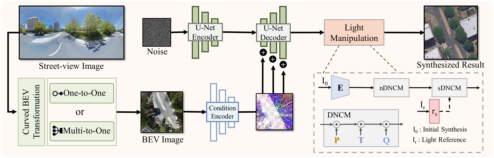

<div align="center">
	
	<h1>Street-to-Satellite Image Synthesis with Diffusion Models and BEV Paradigm</h1>
	<a href="https://arxiv.org/abs/2408.01812"></a>
	<a href="https://longhz140516.github.io/SkyDiffusion.github.io/"></a>
	<a href=""></a>
	<a href=""></a>
</div>




## Abstract
Street-to-satellite image synthesis focuses on generating realistic satellite images from corresponding ground street-view images while maintaining a consistent content layout, similar to looking down from the sky. The significant differences in perspectives create a substantial domain gap between the views, making this cross-view generation task particularly challenging. In this paper, we introduce SkyDiffusion, a novel cross-view generation method for synthesizing satellite images from street-view images, leveraging diffusion models and Bird's Eye View (BEV) paradigm. First, we design a Curved-BEV method to transform street-view images to the satellite view, reformulating the challenging cross-domain image synthesis task into a conditional generation problem. Curved-BEV also includes a "Multi-to-One" mapping strategy for combining multiple street-view images within the same satellite coverage area, effectively solving the occlusion issues in dense urban scenes. Next, we design a BEV-controlled diffusion model to generate satellite images consistent with the street-view content, which also incorporates a light manipulation module to optimize the lighting condition of the synthesized image using a reference satellite. Experimental results demonstrate that SkyDiffusion outperforms state-of-the-art methods on both suburban (CVUSA & CVACT) and urban (VIGOR-Chicago) cross-view datasets, with an average SSIM increase of 14.5% and a FID reduction of 29.6%, achieving realistic and content-consistent satellite image generation.

<!--
## Installation
Clone this repo to a local folder:
```bash
git clone https://github.com/opendatalab/skydiffusion
cd skydiffusion
```

## License

This project is licensed under the MIT License. See the [LICENSE](LICENSE) file for details.


## Requirements
We provide an available conda environment named skydiffusion. You can configure the necessary Python environment for the experiments by following these steps:
```bash
conda create --name skydiffusion python=3.9
conda activate skydiffusion
conda env update --name skydiffusion --file environment.yaml
```

## Data Preparation
The publicly available datasets used in this paper can be obtained from the following sources: 

**Preparing CVUSA Dataset.**  The dataset can be downloaded [here](https://mvrl.cse.wustl.edu/datasets/cvusa). After unzipping the dataset, prepare the training and testing data as discussed in [our paper](https://www.arxiv.org/abs/2408.01812),  We have also prepared categorized dataset documentation in the datasets folder.

**Preparing CVACT Dataset.**  The dataset can be downloaded [here](https://github.com/Liumouliu/OriCNN). After unzipping the dataset, prepare the training and testing data as discussed in [our paper](https://www.arxiv.org/abs/2408.01812),  We have also prepared categorized dataset documentation in the datasets folder.


## Generating Satellite Images Using Our Pre-trained Model
 1. You can download a pre-trained model (e.g. cvusa) with the following script:
```bash
bash ./scripts/download_skydiffusion_model.sh cvusa
```
 2. Use the provided pre-trained model to generate satellite images according to the following code:
```bash
python test.py \
    --num_gpus=4 \
    --config_path=./models/lacldm_v15.yaml \
    --image_width=512 --image_height=512 \
    --result_dir= [Output folder] \
    --model_path=./ckpt/CVUSA/Skydiffusion_CVUSA.ckpt \
    --data_file_path=./datasets/CVUSA_test.csv \
```

## Train Your Own Models
You can also train your own models with the following commands:
 1. Prepare your datasets
 2. Run the following scripts
```bash
python omnicity_train.py \
    --sd_locked=False --accumulate_grad_batches=8 \
    --num_gpus=8 \
    --max_epochs=100 \
    --config_path=./models/lacldm_v15.yaml \
    --model_path=./models/lacontrol_sd15_ini.ckpt \
    --learning_rate=1e-5 --batch_size=8 --image_width=512 --image_height=512 \
    --train_data_file=./dataset/CVUSA_train.csv \
    --valid_data_file=./datasets/CVUSA_test.csv
```
-->
